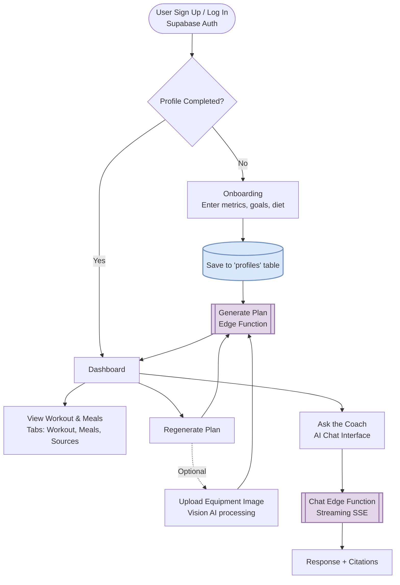

# EvidenceFit

EvidenceFit is an evidence-based, AI-powered health and fitness application. It generates personalized workout and meal plans tailored to the user's goals, body metrics, and available equipment, backing its recommendations with citations from scientific research. It also features an AI coach that provides evidence-based answers to user queries.

## Features
- **Personalized Planning:** Creates tailored workout routines and meal plans based on your profile (age, weight, goal, diet preference, training hours).
- **Vision AI Equipment Inventory:** Upload a photo of your gym setup or home equipment. The AI identifies your equipment and builds a routine exclusively using what you have.
- **Evidence-Based Rationale:** Provides citations and research sources justifying the structure of your plan.
- **AI Coach Chat:** A chat interface where you can ask fitness and nutrition questions. It responds using scientific literature and provides direct citations.

## How It Works

The application flow leverages React on the frontend and Supabase (Auth, Database, and Edge Functions) on the backend to orchestrate AI generation.

### 1. Onboarding & Profiling
New users start at the onboarding screen to fill out basic stats (gender, age, height, weight, activity level) and their goal (e.g., build muscle, lose fat). This data is stored in the Supabase PostgreSQL `profiles` table.

### 2. Plan Generation
Once onboarded, a request is made to the `generate-plan` Supabase Edge Function. It calls an LLM to generate a customized JSON structure representing the user's workout split, exercises (with sets, reps, and RIR), and a daily meal plan with macro breakdowns.

### 3. Equipment Vision Tailoring (Optional)
On the Dashboard, users can upload an image of their gym or available equipment. The frontend sends this base64 image to the `generate-plan` function, which uses a Vision Model to identify the available equipment and constraints the workout plan accordingly.

### 4. AI Coach Chat
Users can interact with an AI coach via the `/chat` route. Messages are sent to the `chat` Edge Function, which streams back responses using Server-Sent Events (SSE). The AI focuses on providing scientific rationale and specific peer-reviewed citations to answer the user's fitness questions.

## Tech Stack
- **Frontend:** React, Vite, Tailwind CSS, Radix UI components (shadcn/ui), Framer Motion.
- **Backend & Auth:** Supabase (PostgreSQL, Authentication).
- **Serverless / AI:** Supabase Edge Functions.
- **Routing:** React Router DOM.
- **Icons & Markdown:** Lucide React, React Markdown (with remark-gfm).
